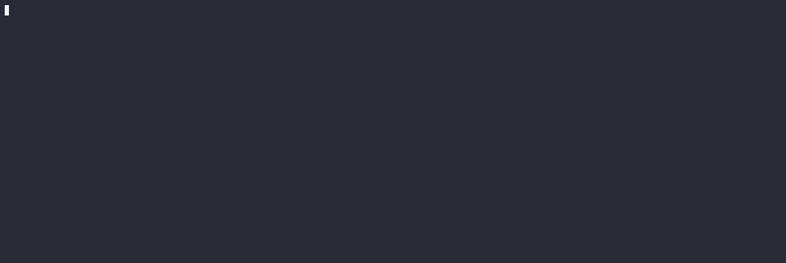

<div align="center">
  <h1>TeaLang</h1>
</div>

---

## What is TeaLang?

It is a compiler for a tea language. You can write programs in it, compile and run them! TeaLang is currently
implemented as a frontend for LLVM. It has its own tokenizer, parser, AST, semantic analysis and LLVM IR generator. Then
LLVM does its magic to produce an executable from LLVM IR.

Tea language uses [cpp2](https://github.com/hsutter/cppfront) grammar.



## How to use it?

Note: the project assumes that LLVM 22 or 23 is installed in your system. `clang++` must be in your PATH. You can use docker image described in
`Dockerfile` to quickly set up all required dependencies. Testing additionally requires the following LLVM tools: `lit`,
`FileCheck`, and `llc`. You can disable testing targets
by passing `-DTLANG_TEST=OFF`.

### Step 1: clone repo and its dependencies

```shell
git clone --recursive https://github.com/MishkaSimakov/RecursiveFunctions
cd RecursiveFunctions
```

### Step 2: build tlang cli with CMake

```shell
mkdir build
cmake -S . -B build
cmake --build build -t tlang
```

### Step 3: use it

Create `main.tea` file:

```tea
import "io"

main: () -> i64 = {
    println("hello world!");
    return 0;
}
```

Then compile and run it.

```shell
build/bin/tlang main.tea
./out
```

### Step 4 (optional): test it

There are two types of tests: lit and unit. You can run both of them:

```shell
cmake --build build -t tests.unit
./build/bin/tests.unit

cmake --build build -t tests.lit
```

### Step 5 (optional): install it

```shell
cmake --build build -t tlang
sudo cmake --install build
tlang --version
```

## Further info

There are a few examples in `examples` directory. You can build and run them using Make. For example to play a game
implemented completely in tea language run:

```shell
cd examples/game
make run TLANG=../../build/bin/tlang
```

You can find more information in [documentation (ru)](docs/ru.md). 